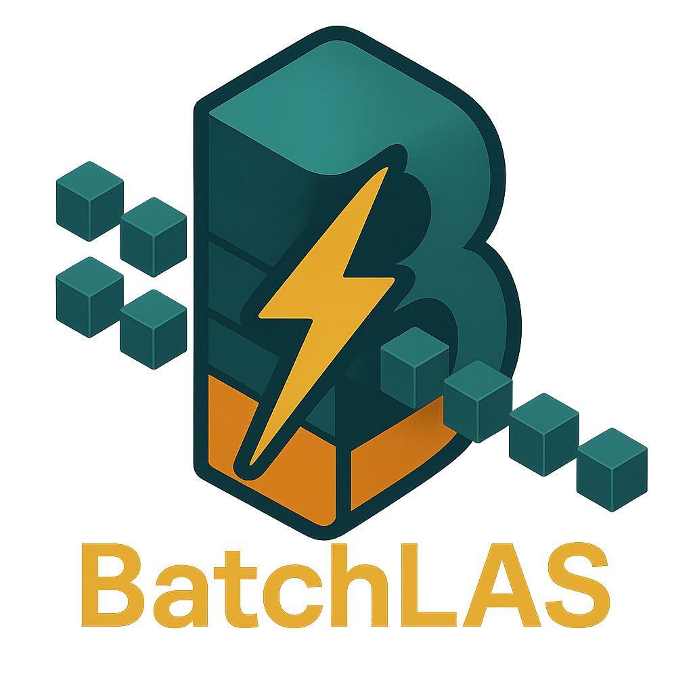

<div align="center">
  
</div>

# BatchLAS

BatchLAS is a SYCL-first batched linear algebra library with optional vendor backends for CUDA, ROCm, netlib BLAS/LAPACK, and oneMKL. The repository currently contains the C++ library, an optional pybind11-based Python package, a broad unit-test suite, benchmark executables, tuning scripts, and research notebooks used to validate newer eigensolver and factorization work.

## Current Status

- SYCL is mandatory for building the library.
- The project builds as `C++20` and defaults to `RelWithDebInfo`.
- The installed CMake package exports `BatchLAS::batchlas` plus component libraries.
- The repository includes active work on dense factorizations, spectral routines, orthogonalization, sparse eigensolvers, and performance benchmarking.
- Recommended development entry points are the CMake presets in `CMakePresets.json`.

## Using the C++ API

The backend comes from the `Queue`, options are structs with defaults, and
workspaces are leased from a per-queue arena, so a call is usually one line:

```cpp
#include <blas/linalg.hh>
using namespace batchlas;

Queue ctx(Device::default_device());   // backend resolved from the device
gemm(ctx, A.view(), B.view(), C.view(), {.alpha = 2.0f});
potrf(ctx, A.view(), {.uplo = Uplo::Upper});
ctx.wait();
```

There is also a `batchlas::linalg` convenience layer with value-returning and
elementwise operations:

```cpp
auto X = linalg::solve(ctx, A.view(), B.view());   // A X = B
auto e = linalg::eigh(ctx, A.view());              // e.values, e.vectors
auto P = linalg::multiply(ctx, A.view(), B.view());  // Hadamard, not matmul
```

See **[docs/cpp-api.md](docs/cpp-api.md)** for the full conventions, the
workspace-lifetime caveat on out-of-order queues, and a migration guide from the
older `gemm<Backend::CUDA, float>(...)` spelling — which still compiles.

## Implemented Surface Area

The public C++ headers under `include/` currently expose these main groups of functionality.

### Dense BLAS and Factorization

- `gemm`, `gemv`, `symm`, `syrk`, `syr2k`, `trmm`, `trsm`
- `potrf`, `getrf`, `getrs`, `getri`
- `geqrf`, `orgqr`, `ormqr`
- `syev`, `gesvd`

### Sparse and Spectral Extensions

- `spmm`
- `syevx` for partial symmetric eigensolves
- `lanczos`
- `steqr`, `stedc`, and related tridiagonal helpers
- `ritz_values`
- `iluk` preconditioning support

### Orthogonalization and Utilities

- `ortho` with multiple orthogonalization algorithms
- matrix generators and structured constructors
- norms, condition numbers, transpose, and related helpers

### Python Package

When `BATCHLAS_BUILD_PYTHON=ON`, the repository builds a `batchlas` Python package with NumPy dense-array support and SciPy sparse wrappers for the supported public APIs. The Python facade also exposes convenience helpers such as `available_backends()`, `available_devices()`, and `compiled_features()`, plus elementwise arithmetic (`add`, `subtract`, `multiply`, `divide`, `axpby`, `scale`) over batched dense arrays.

Twelve self-checking example notebooks covering the whole Python surface live in `python/examples/`. They are committed with output from a reference run, so they render on GitHub without executing anything:

```bash
cd python/examples
PYTHONPATH=../../build/python jupyter lab            # open them
PYTHONPATH=../../build/python python3 run_all.py     # execute and check all twelve
```

See `python/examples/README.md` for the index, the array/batching conventions, and current known issues.

## C++ Examples

Twelve self-checking C++ programs in `examples/cpp/` cover the same ground as the Python notebooks, from `01_getting_started.cc` through the dense BLAS, factorizations, the SVD and eigensolver families, the tridiagonal reduction stages, sparse and iterative solvers, and a measurement example for picking a variant. Each verifies its results against an independent host-side reference and exits non-zero if a check fails.

```bash
cmake -B build -S . -DBATCHLAS_BUILD_EXAMPLES=ON
cmake --build build -j"$(nproc)"

./build/examples/cpp/01_getting_started        # prints [ok  ]/[FAIL] per check
./build/examples/cpp/06_symmetric_eigensolvers cpu    # force the host backend
```

With `BATCHLAS_BUILD_TESTS=ON` as well, each example is registered with CTest as `example_<name>`. `examples/cpp/CMakeLists.txt` also builds standalone against an installed BatchLAS, so it doubles as a template for consuming the exported `BatchLAS::batchlas` target.

See `examples/cpp/README.md` for the index, the C++ conventions the Python facade hides (compile-time backend selection, column-major storage, the `*_buffer_size` workspace contract), and the current known issues.

## Repository Layout

- `include/`: public C++ headers
- `src/`: library implementation and backend/component targets
- `tests/`: GoogleTest-based unit tests and smoke-test subset
- `benchmarks/`: performance and accuracy benchmark executables
- `examples/cpp/`: self-checking C++ examples (`BATCHLAS_BUILD_EXAMPLES=ON`)
- `python/`: pybind11 bindings, Python facade, Python tests, and `examples/`
- `scripts/`: benchmark campaign helpers and result-processing scripts
- `playground/`: notebooks and exploratory scripts for algorithm work
- `docs/`: architecture notes and design documentation

## Requirements

Minimum build requirements:

- CMake 3.14+
- A C++20 compiler with SYCL support
- A SYCL runtime/toolchain discoverable by CMake

Common optional dependencies:

- CUDA Toolkit for NVIDIA backends
- ROCm for AMD backends
- LAPACKE and CBLAS for the netlib host backend
- oneMKL for the optional MKL backend
- Python 3, pybind11, NumPy, and SciPy for Python bindings

Notes:

- SYCL support is not optional in the current build system.
- The CMake logic is primarily written around IntelLLVM/Clang-style SYCL compilers.
- The default build type is `RelWithDebInfo`, not `Debug`.

For a Linux-oriented environment setup with package suggestions and oneAPI notes, see `AGENTS.md`.

## Build

### Recommended Preset Workflow

Configure and build using the checked-in presets:

```bash
cmake --preset dev
cmake --build --preset dev
```

Useful presets currently provided:

- `dev`: default `RelWithDebInfo` library build
- `dev-tests`: library build with the full test suite enabled
- `fast-dev`: library build plus the smoke-test subset
- `benchmarks`: benchmark build with tuning support enabled
- `cuda`: optional CUDA-enabled build when the environment supports it

### Manual Configuration

```bash
cmake -S . -B build \
  -DCMAKE_BUILD_TYPE=RelWithDebInfo \
  -DBATCHLAS_BUILD_TESTS=ON \
  -DBATCHLAS_BUILD_BENCHMARKS=OFF \
  -DBATCHLAS_BUILD_PYTHON=OFF

cmake --build build -j"$(nproc)"
```

Common CMake options:

- `BATCHLAS_BUILD_TESTS`: build unit tests
- `BATCHLAS_BUILD_BENCHMARKS`: build benchmark executables
- `BATCHLAS_BUILD_PYTHON`: build the Python package
- `BATCHLAS_ENABLE_CUDA`: enable CUDA backend support
- `BATCHLAS_ENABLE_ROCM`: enable ROCm backend support even if no AMD GPU is auto-detected
- `BATCHLAS_ENABLE_NETLIB`: enable the host netlib backend
- `BATCHLAS_ENABLE_MKL`: enable the oneMKL backend
- `BATCHLAS_ENABLE_TUNING`: enable tuning targets; intended for benchmark builds
- `BATCHLAS_CPU_TARGET`: override SYCL CPU target selection (`auto`, `native_cpu`, `spir64_x86_64`, `none`)
- `BATCHLAS_TEST_TARGET_SET`: choose `all` or `smoke`
- `BATCHLAS_AMD_ARCH`: override ROCm target architecture
- `BATCHLAS_NVIDIA_ARCH`: override CUDA target architecture

## Test

Build tests and run them with either the preset or a manual build:

```bash
cmake --preset dev-tests
cmake --build --preset dev-tests
ctest --test-dir build/presets/dev-tests --output-on-failure
```

For a faster edit-build-test loop, the `fast-dev` preset builds only the smoke subset:

- `util_span_tests`
- `util_vector_tests`
- `matrix_tests`

## Benchmarks and Tuning

The repository contains a large benchmark suite under `benchmarks/`, including BLAS kernels, QR/SVD paths, eigensolvers, band reduction, and sparse workflows. A typical benchmark build looks like this:

```bash
cmake --preset benchmarks
cmake --build --preset benchmarks
```

The `scripts/` directory contains campaign helpers and archived CSV outputs from prior runs. Tuning support is wired through `BATCHLAS_ENABLE_TUNING` and the optional `BATCHLAS_TUNING_PROFILE` cache entry.

## Python Bindings

Enable the Python package like this:

```bash
cmake -S . -B build \
  -DCMAKE_BUILD_TYPE=RelWithDebInfo \
  -DBATCHLAS_BUILD_PYTHON=ON \
  -DBATCHLAS_BUILD_TESTS=ON

cmake --build build -j"$(nproc)"
```

The build places the importable package under `build/python`, so a build-tree import looks like:

```bash
PYTHONPATH="$PWD/build/python" python3 -c "import batchlas; print(batchlas.available_backends())"
```

The extension module is built with pybind11 and linked against the installed or in-tree `BatchLAS::batchlas` target.

## Consuming BatchLAS from CMake

After installation, the project exports a standard CMake package. A consuming project can use:

```cmake
find_package(BatchLAS CONFIG REQUIRED)
target_link_libraries(my_target PRIVATE BatchLAS::batchlas)
```

The install tree also exports the generated configuration headers needed by the public interface.

## Development Notes

- The top-level `batchlas` target is an interface facade over split component libraries.
- The repository includes implementation notes for ongoing work in the root markdown files and under `docs/`.
- `playground/` contains exploratory notebooks and scripts used during algorithm development.

## License

BatchLAS is licensed under the MIT License. See `LICENSE` for the full text.