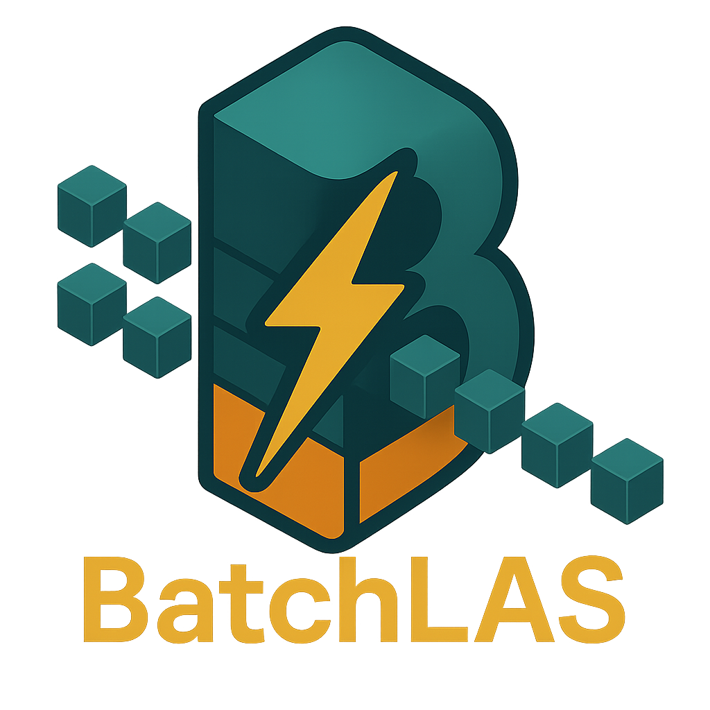

<div align="center">
  
</div>

BatchLAS is a high-performance library for batched linear algebra operations that supports multiple backends. It provides an abstraction layer over different vendor-specific libraries while maintaining high performance.

## Features

- Unified API for different hardware backends
- Batched matrix operations
- Support for dense and sparse matrices
- SYCL interoperability for cross-platform performance

## Currently Implemented Operations
- **Dense Matrix Operations**
  - Basic BLAS operations (gemm, gemv, trsm)
  - Cholesky factorization (potrf)
  - Symmetric eigenvalue decomposition (syev)
  - Matrix orthogonalization with multiple algorithms:
    - Cholesky-based methods (Chol2, ShiftChol3)
    - Classical Gram-Schmidt with reorthogonalization (CGS2)
    - Householder
    - SVQB

- **Sparse Matrix Operations**
  - Sparse matrix-dense matrix multiplication (spmm)
  - Sparse symmetric eigensolvers:
    - Batched LOBPCG for partial eigendecomposition (finding largest or smallest eigen-pairs, provided via the `syevx` implementation, supports sparse and dense matrices)
    - Batched Lanczos algorithm for full eigendecompositions (supports sparse and dense matrices)
  - CSR format support

## Working Backends
- NVIDIA CUDA (cuBLAS, cuSOLVER, cuSPARSE)
- Intel oneMKL (CPU)
- CPU (CBLAS, LAPACKE)

## Requirements

- C++17 compatible compiler
- CMake 3.14 or higher
- SYCL implementation (Intel oneAPI DPC++)
- Optional: CUDA toolkit for NVIDIA GPUs
- Optional: Netlib BLAS/LAPACK for CPU
- Optional: Intel oneMKL for optimized CPU backend
- For oneMKL support, set the `MKLROOT` environment variable to your oneAPI installation
- Optional: Python 3.x (for Python bindings)

## Installation

### Basic Installation

```bash
git clone https://github.com/yourusername/BatchLAS.git
cd BatchLAS
mkdir build && cd build
cmake ..
make -j$(nproc)
make install
```

### Configuration Options

BatchLAS can be configured with various options:

```bash
cmake .. \
  -DBATCHLAS_BUILD_TESTS=ON \
  -DBATCHLAS_BUILD_EXAMPLES=ON \
  -DBATCHLAS_ENABLE_CUDA=ON \
  -DBATCHLAS_ENABLE_OPENMP=ON \
  -DBATCHLAS_BUILD_PYTHON=ON
```

Available options:
- `BATCHLAS_BUILD_TESTS`: Build test suite (default: ON)
- `BATCHLAS_BUILD_EXAMPLES`: Build examples (default: OFF)
- `BATCHLAS_BUILD_DOCS`: Build documentation (default: OFF)
- `BATCHLAS_ENABLE_CUDA`: Enable CUDA support (default: OFF)
- `BATCHLAS_ENABLE_OPENMP`: Enable OpenMP support (default: OFF)
- `BATCHLAS_BUILD_PYTHON`: Build Python bindings (default: ON)

## Quick Start

Here's a simple example of using BatchLAS for matrix multiplication:

```cpp
#include <batchlas.hh>

using namespace batchlas;

int main() {
    // Create a context
    auto ctx = Queue(Device::default_device());
    
    // Define matrix dimensions
    const int rows = 1000;
    const int cols = 1000;
    const int k = 1000;
    const int batch_size = 10;
    
    // Create matrices using factory methods
    auto A = Matrix<float>::Random(rows, k, batch_size);
    auto B = Matrix<float>::Random(k, cols, batch_size);
    auto C = Matrix<float>::Zeros(rows, cols, batch_size);
    
    // Initialize data (if needed, Random already initializes)
    // A.fill(1.0f); // Example: fill A with 1.0f
    // B.fill(2.0f); // Example: fill B with 2.0f
    
    // Perform batched matrix multiplication using views of the matrices
    gemm<Backend::AUTO>(ctx, A, B, C, 1.0f, 0.0f, Transpose::NoTrans, Transpose::NoTrans);
    
    // Wait for completion
    ctx.wait();
    
    return 0;
}
```

## Advanced Features

### Orthogonalization

BatchLAS provides various orthogonalization algorithms:

```cpp
// Allocate workspace memory
UnifiedVector<std::byte> workspace(ortho_buffer_size<Backend::AUTO>(
    ctx, matrices, Transpose::NoTrans, OrthoAlgorithm::ShiftChol3));

// Orthogonalize matrices
ortho<Backend::AUTO>(ctx, matrices, Transpose::NoTrans, workspace, OrthoAlgorithm::ShiftChol3);
```

## Testing

To run the test suite:

```bash
cd build
ctest
```

## Performance Tuning

BatchLAS automatically selects the most suitable backend for your hardware, but you can manually specify a backend for optimal performance in specific use cases:

```cpp
// Use CUDA backend explicitly on NVIDIA hardware
gemm<Backend::CUDA>(ctx, A, B, C, alpha, beta, Transpose::NoTrans, Transpose::NoTrans);
```

## License

TBD
